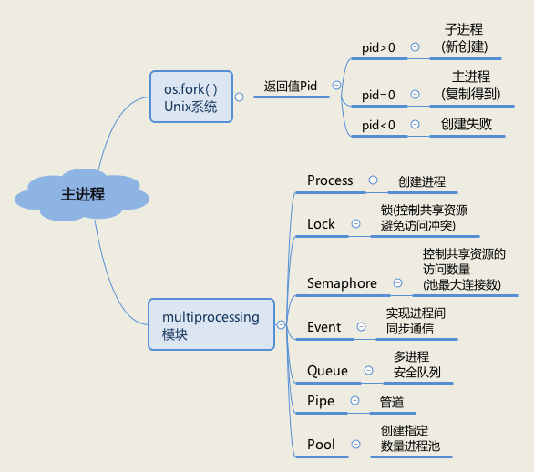
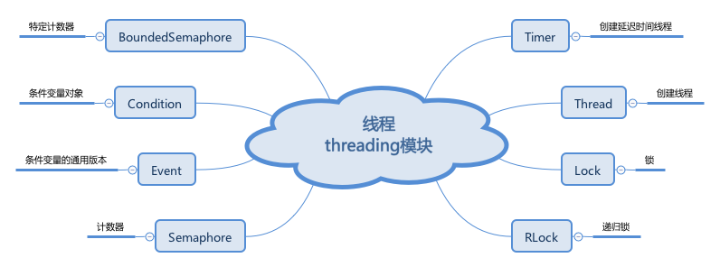

#### 进程
在python的中，每一个python程序都是一个主进程，称为父进程。主进程中可以通过os模块的fork()函数创建多个子进程。

#### 线程
线程可以理解为是一个轻量级的进程，
提到Python的线程，就离不开Python的默认解释器CPython中的GIL全局锁。

`GIL锁:`GIL的全名，Global Interpreter Lock。GIL并不是Python的特性，而是CPython解释器，Python完全可以不依赖于GIL，现在很多默认环境就是CPython的Python，GIL的存在更多的是历史原因。
这个锁就是用来为了解决Cpython多线程中线程不安全问题引入的一个全局排它锁，它的作用就是在多线程情况下，保护`共享资源`，为了不让多个线程同时操作共享资源，导致不可预期的结果而加上的锁，在一个线程操作共享资源时，其他线程请求该资源，只能等待GIL解锁。这个设置在Cpython刚引入多线程概念的时候就有了，然后后续的各种包和组件开发都不可避免的受到了GIL的影响.

`线程安全:` 就是多线程访问时，采用了加锁机制，当一个线程访问该类的某个数据时，进行保护，其他线程不能进行访问直到该线程读取完，其他线程才可使用。不会出现数据不一致或者数据污染。 线程不安全就是不提供数据访问保护，有可能出现多个线程先后更改数据造成所得到的数据是脏数据。

`线程不安全通俗的说：` 我的代码写好了，别人又去修改我的代码，造成我执行代码的时候结果与预期不一样。更确切的说就是不存在共享同一状态。

#### 协程

